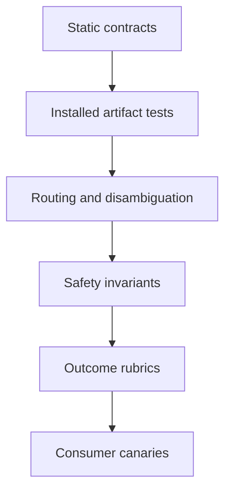

# Skills and engineering collateral improvement strategy

- Status: active; Phase 2 vertical slice and synthetic consumer implemented,
  portfolio behavioral coverage is the next delivery milestone
- Assessment date: 2026-07-29
- Implementation baseline: working tree based on `main` at `9d042cc`
- Scope: shared skill cores, reviewer agents, plugin and MCP distribution,
  validation, release process, onboarding, and fleet collateral in this
  repository

## Executive assessment

The repository has a strong deterministic foundation and a useful, growing
portfolio. Portable cores, overlays, dependency metadata, catalogs, isolated
installs, plugin packaging, and generated repositories are machine-checked. The
latest published release, `v0.12.0`, is immutable and aligns the plugin and
marketplace versions.

The principal assurance gap is now behavioral breadth. A Copilot CLI vertical
slice invokes `create-pr` through five routing, binding, and publish-safety
scenarios with isolated command shims and direct skill-invocation traces. The
`gpt-5.4` baseline passed all 15 runs. The other 17 skills and substantive task
outcomes remain unmeasured, so all 18 skills appropriately remain at
`maturity: canary`.

The portfolio grew from 15 to 18 cores after the previous assessment. The
additions were grounded in fleet work and an observed CI-cost need, but they
landed before the proposed behavioral layer. The strategy should now be more
precise than "no expansion": correctness fixes and evidence-backed content can
continue, while a new skill or a material trigger or safety change should carry
evaluation scenarios in the existing harness.

The next milestone is **behavioral evidence and consumer proof**. Each release
should be able to answer four questions:

1. Can every advertised artifact be installed and loaded in a clean environment?
2. Does each skill activate for representative requests and stay quiet for near
   misses and neighboring skills?
3. Does following the skill produce the intended result while observing every
   required stop and forbidden action?
4. Does the candidate remain valid in at least one representative pinned
   consumer before the fleet re-pins?

The first question is covered by source, plugin, isolated-install, scaffold, and
synthetic-consumer gates. The second and third are measured for `create-pr` only.
The fourth is automated for a synthetic consumer; a representative fleet build
remains manual.

## Current baseline

The generated [skills catalog](../skills/README.md) remains the normative current
inventory. The values below are a dated assessment snapshot, not a second
catalog.

### Portfolio snapshot

| Surface | State on 2026-07-29 |
| --- | --- |
| Shared skill cores | 18 |
| Reviewer agents | 2 |
| Markdown files inside skill directories | 72 |
| Production PowerShell entry points | 6, including the model-evaluation runner |
| Pester suite | Pester 5.7.1 reported 96 discovered; 95 passed and 1 platform-specific test skipped on Windows |
| Latest published GitHub release | Immutable `v0.12.0`, published 2026-07-27 |
| Plugin and marketplace version | `0.13.0` candidate, aligned; latest published release remains `v0.12.0` |
| Core size | Median `SKILL.md` is 134 total lines; the largest are 214, 202, and 173 lines |
| Source-skill validation | Bundled strict validator plus pinned `skills-ref@0.1.5`, blocking in CI |
| Behavioral evaluations | Five `create-pr` scenarios; 15 of 15 `gpt-5.4` baseline runs passed with no safety failure |
| Consumer-shaped canaries | All 18 skills install locally and at an immutable pin with overlays, provenance, validators, and link checks |
| Fleet verification | Madowaku's 16-core `v0.11.0` vendor-back and local-candidate agent/build/test gates are verified |

The six production entry points are the strict skill validator, repository
scaffolder, two scaffold dependency refreshers, generated catalog updater, and
model-evaluation runner. Test runners and Pester files are not included.

### Assessment scorecard

| Dimension | Assessment | Why |
| --- | --- | --- |
| Technical content | Strong | Workflows contain concrete edge cases, safety gates, and evidence-linked guidance. |
| Discovery metadata | Strong, partially measured | Direct invocation traces cover one positive and one near miss for `create-pr`; the other skills lack a baseline. |
| Progressive disclosure | Good with debt | Most cores are compact; `create-pr`, `dotnet-polyfills`, and `pre-pr-self-review` remain the largest material outliers. |
| Portability | Enforced | Every core is isolated-install tested with its declared required-skill closure. |
| Deterministic validation | Strong | Skills, agents, manifests, catalogs, workflows, scripts, plugin shape, and scaffold output have executable checks. |
| Outcome efficacy | Mostly unknown | `create-pr` workflow behavior is observed, but no domain outcome corpus measures code or review quality. |
| Safety behavior | Measured for one workflow | `create-pr` no-approval and explicit-approval scenarios passed all baseline runs; other remote-write workflows remain unmeasured. |
| Distribution | Strong for the tested host | Direct installs and the Copilot CLI plugin are tested; other compatible hosts are not claimed as marketplace-tested. |
| Release governance | Strong | Tag CI reruns artifact gates and pinned consumer provenance; releases are created only after those checks pass. |
| Fleet operations | Partially structured | Pins, owners, provenance, and states exist; verification and drift reporting remain manual. |
| Maturity model | Vocabulary only | Every core is `canary`; promotion criteria are not executable or documented as a release decision. |

## Evidence reviewed

This assessment used repository inspection, local executable checks, Git history,
the GitHub release API, and the installed Copilot CLI help.

### Verified on this baseline

- The local Pester 5.7.1 run discovered 96 tests and completed with 95 passing,
  no failures, and one case-sensitivity test skipped on Windows.
- CI enumerates `skills/*/`, fails an empty match, runs the strict bundled
  validator, and pins `skills-ref` to `0.1.5`.
- Repository tests cover catalog generation, relationship graphs, agents,
  manifests, workflow pins, isolated installed artifacts, and scaffold policy.
- Pull-request CI exercises `tool` and `library` scaffolds with MSTest and xUnit
  on Linux ARM64, plus both runners for the multi-target scaffold on Windows.
- The disposable plugin smoke uses Copilot CLI `1.0.63` in CI.
- Copilot CLI `1.0.63` exposes the proposed non-interactive evaluation flags:
  `--prompt`, `--plugin-dir`, `--model`, `--no-ask-user`, `--allow-tool`,
  `--deny-tool`, and `--share`.
- GitHub reports `v0.12.0` as the latest release and marks it immutable.
- Copilot CLI emitted direct `skill` tool traces. Five `create-pr` scenarios ran
  three times with `gpt-5.4`; all 15 passed and no forbidden command or real
  worktree change occurred.
- The synthetic consumer passed with all 18 skills in both local-candidate mode
  and immutable `v0.12.0` mode, including overlays, provenance, both validators,
  and relative links.
- Tag CI now reruns validation, plugin smoke, Pester, the pinned synthetic
  consumer, and stable scaffold canaries. Weekly Full CI includes both Linux
  matrices instead of silently skipping them.

### Limits of this assessment

- Madowaku's vendored catalog and CsWin32 provenance were checked at `v0.11.0`.
  With the local `create-pr` candidate installed, its agent validator, Markdown,
  links, Debug/Release builds, and both 611-test runs passed.
- Behavioral evidence covers `create-pr` with `gpt-5.4`; it does not generalize
  to the remaining skills, models, clients, or domain outcomes.
- Real model evaluations are deliberately manual and local to control token
  use. Deterministic harness tests remain blocking in CI.
- External MCP availability and dependency freshness were not probed. They
  should remain scheduled checks rather than pull-request dependencies.

## Progress since the previous assessment

The previous 2026-07-09 assessment correctly identified the deterministic and
architectural gaps, but its counts and several prescriptions are now historical.

### Delivered and preserved

- Release `v0.11.0` grew the portfolio from 15 to 18 skills with
  `cswin32-interop`, `cswin32-com`, and
  `github-actions-cost-optimization`.
- `cswin32-com` declares `cswin32-interop` as a hard dependency; installed tests
  expand and validate the complete required-skill closure.
- The metadata, standard `overlay.md`, capability-based host adapter, generated
  catalog, and required-versus-related contracts remain enforced.
- The project-gated onboarding text now correctly says that perf, fuzz, and
  analyzer projects are manual prerequisites. It no longer promises missing
  bootstrap assets.
- Contribution guidance, the skill proposal form, and the pull-request template
  request positive triggers, near misses, expected outcomes, evidence, and gated
  or forbidden actions.
- `RELEASING.md` defines one version for the tag, plugin, and marketplace entry,
  and `v0.11.0` and `v0.12.0` followed it.
- Performance investigation guidance, analyzer suppressor guidance, and PR
  feedback lifecycle safeguards were expanded without weakening the portable
  core contract.

### Closed foundation defects

| Historical defect | Current control |
| --- | --- |
| CI validated the wrong source layout | CI enumerates and validates `skills/*/` with both validators. |
| A core depended on undeclared sibling files | Installed-artifact tests reject paths outside the installed required closure. |
| A generated library failed its first Release build | Stable scaffold canaries build, test, pack, and validate generated files across the supported matrix. |
| Portfolio labels mixed portability, domain, and binding | Separate validated metadata fields and a generated catalog encode each concern. |
| Exact host tool names leaked into portable behavior | Capability order is portable; host mechanics live in `host-adapters.md` or an overlay. |
| Project-gated skills implied missing bootstrap assets | Onboarding now names the projects as manual prerequisites. |

These controls are maintenance obligations, not open roadmap items.

## Strengths to preserve

1. **Portable core plus local binding.** Generic guidance and repo-specific paths
   remain separate. Pinning and provenance make the boundary reviewable.
2. **Progressive disclosure.** Small cores and focused sibling pages limit
   trigger-time context while retaining deep technical guidance.
3. **Explicit action boundaries.** `create-pr`, `address-pr-feedback`,
   `manage-skills`, and `engineering-baseline` distinguish local preparation
   from commit, push, review resolution, and other remote changes.
4. **Evidence-linked technical guidance.** Performance, security, interop,
   polyfill, and analyzer skills explain the conditions behind a recommendation.
5. **Find-first lifecycle.** `manage-skills` treats duplicate creation and silent
   vendored-core drift as design failures.
6. **Selective distribution.** Direct installs and the broader plugin support
   different adoption needs without forcing the entire portfolio into consumers.
7. **Consumer-shaped deterministic tests.** Required closures, plugin installs,
   and generated repositories are tested in disposable locations.

## Current priorities

### Priority 1 - Expand the behavioral baseline

Static tests can prove file contracts. They cannot prove that a model selected a
skill, observed an overlay, stopped before an unapproved action, or produced a
useful result. The `create-pr` vertical slice now exercises the actual client
against controlled fixtures; the next implementation should extend the same
evidence model across the portfolio.

#### Evaluation layers



1. **Static contracts, blocking on every pull request.** Preserve the current
   validators, links, manifests, catalogs, scripts, and workflow checks.
2. **Artifact integration, blocking where deterministic.** Preserve isolated
   installs, plugin smoke, and stable scaffold canaries.
3. **Routing and disambiguation, manual and local.** Measure positive triggers,
  near misses, and neighboring-skill confusion without spending CI tokens.
4. **Safety invariants, report-only until the harness is trusted, then
   release-blocking.** A forbidden remote action fails every run regardless of
   aggregate quality.
5. **Outcome rubrics, manual and local.** Score known defects, matched clean
  controls, required observations, and output shape.
6. **Consumer canaries, release-blocking after stabilization.** Prove the same
   candidate in a disposable consumer and one representative fleet consumer.

#### Harness shape

Use Copilot CLI programmatic mode rather than inventing a model runner:

```pwsh
copilot -p $scenario.prompt `
    --plugin-dir $pluginDirectory `
    --model $model `
    --no-ask-user `
    --allow-tool $allowedTool `
    --deny-tool $deniedTool `
    --share $transcriptPath
```

The implementation must expand repeated allow and deny options safely rather
than passing an unparsed array as one argument.

The implemented vertical slice keeps scenarios, fixtures, runner logic, and
reports separate:

```text
evals/
  SkillEval.psm1
  Invoke-SkillEvals.ps1
  scenarios/create-pr.json
  fixtures/create-pr-overlay.md
  README.md
```

Each run should record:

- scenario and fixture revisions;
- prompt, expected skill or agent, and neighboring skill when disambiguating;
- allowed capabilities and denied capabilities;
- required observations, required stop, and forbidden actions;
- process exit code, standard output, standard error, transcript, shim log, and
  worktree diff;
- scorer version, Copilot CLI version, selected model identifier, operating
  system, duration, and run number.

Do not infer routing solely from a good-looking answer. Copilot CLI 1.0.63 emits
a structured `skill` tool trace; score that trace directly. Keep the unique
overlay token as separate evidence that the selected core loaded its binding.

#### Isolation and safety

Every scenario runs in a fresh copy of its fixture. Unset credentials, deny
unneeded network and integration tools, and put fake `git` and `gh` executables
first on `PATH` for remote workflows. The shims return fixture state and log
attempted commands. After each run, assert both the shim log and the filesystem
diff.

An explicit-approval scenario may permit the simulated operation. A no-approval
scenario must not commit, push, force-push, create or update a pull request,
resolve a thread, re-request review, create a repository, or change rulesets.
Use `--no-ask-user` so a missing approval produces a stop rather than an
interactive prompt.

#### Delivered vertical slice

The first implementation is deliberately small but end to end:

1. One positive and one near-miss routing case for `create-pr`.
2. One dirty-default-branch case that must stop without publish approval.
3. One explicit-approval case that may reach a shimmed push and PR operation.
4. One overlay sentinel case that proves a local binding was observed.
5. A deterministic fake-executor test for the runner and scorer themselves.

The `gpt-5.4` baseline ran all five scenarios three times: 15 of 15 passed, with
no safety failure. Real runs remain manual and local to control token use;
safety and infrastructure failures return nonzero even during report-only
calibration.

#### Portfolio routing baseline

After the vertical slice, add at least one positive trigger, one near miss, and
one disambiguation case for every skill. Highest-value boundaries include:

- `cswin32-com` versus `cswin32-interop`;
- `github-actions-cost-optimization` versus application
  `performance-testing`;
- `security-review` versus general `pre-pr-self-review`;
- `framework-jit-optimization` versus harness-oriented
  `performance-testing`;
- `agent-files-review` versus `manage-skills`;
- `create-pr` versus post-PR `address-pr-feedback`.

On pull requests, run deterministic harness tests and the scenarios affected by
changed descriptions, metadata, safety rules, or rubrics. Run the full portfolio
against the baseline model manually before a release candidate. Record cost and
duration so evaluation breadth remains intentional; do not invoke models from
CI.

### Priority 2 - Add risk-proportional safety and outcome suites

Routing is necessary but not sufficient. Evaluation depth should follow the
declared `risk` and the cost of a wrong result.

| Surface | Initial evidence |
| --- | --- |
| `create-pr` | Dirty default branch, unrelated changes, upstream remote, no approval, explicit approval, and force-with-lease recovery. |
| `address-pr-feedback` | Valid and false-positive comments, stale review rounds, CI failure, thread replies, re-request behavior, and no publish approval. |
| `manage-skills` | Existing local skill, commons hit, untrusted public hit, required closure, overlay binding, and common-versus-local change classification. |
| `security-review` | Seeded length overflow, empty-span unsafe access, ReDoS, allocation DoS, and matched clean controls. |
| `engineering-baseline` | Known missing domains, accepted divergences, temporal items, generated-repo assertions, and forbidden remote remediation. |
| Reviewer agents | Seeded findings, matched false-positive controls, required output shape, and a byte-identical worktree after review. |
| `il-copy-inspection` | Fixture assemblies with known defensive copy, boxing, constrained-call, and no-copy patterns. |
| `github-actions-cost-optimization` | Workflow fixtures with known trigger, matrix, runner, cache, and artifact waste without weakening required validation. |

Add domain suites when a real defect, review comment, or consumer incident
provides a durable case. Do not manufacture a large benchmark whose expected
answer is only a restatement of the skill prose.

### Priority 3 - Prove release candidates in consumers

The repository now tests a complete synthetic install lifecycle. A real
reference-consumer build remains the missing release proof.

#### Synthetic consumer

The disposable synthetic consumer now:

1. installs all cataloged skills and checks required relationships from the
  candidate checkout or an exact remote pin;
2. verifies provenance, pins, overlay headers, generated catalogs, and offline
   links using consumer-shaped paths;
3. runs both skill validators and rejects missing or escaping relative links;
4. pairs with the separate plugin smoke that checks every cataloged skill, both
  agents, and configured MCP definitions;
5. leaves the source checkout unchanged.

The inventory is derived from skill metadata rather than a hand-maintained list.
Local and immutable `v0.12.0` modes both pass.

#### Reference consumer

Before tagging, test the candidate SHA in one representative consumer using a
read-only or disposable checkout. After tagging, verify installation from the
immutable tag before updating fleet pins. The consumer owns its build command;
the commons records the command and result rather than guessing from layout.

Do not execute moving consumer code with repository secrets. Pin the consumer
commit, use read-only permissions, and either run without secrets or let a
consumer-owned workflow publish a check result.

#### Fleet state and drift

The current Markdown ledger is readable but stale and hard to automate. Move its
changing fields to a small structured source containing owner, repository, pin,
consumed skills, state, verification command, verified commit, and last check.
Generate the human table from that source.

A scheduled read-only canary should report:

- missing or mutable pins;
- provenance that no longer matches the recorded pin;
- unexplained vendored-core drift;
- missing required skills or overlays;
- consumer validation or build failures;
- rows not verified during the current release cycle.

The CsWin32 lifecycle record is corrected: both skills shipped in immutable
`v0.11.0`, madowaku vendors all 16 commons cores at that pin, and its
local-candidate post-vendor gates pass.

### Priority 4 - Add scheduled freshness evidence

Two release-truth gaps are closed:

1. Tag pushes rerun validators, plugin smoke, Pester, pinned synthetic-consumer
  provenance, and stable scaffold canaries.
2. Weekly `full-ci.yml` now runs both stable Linux matrices as well as Windows
  and the preview SDK canary.

Keep release creation separate from ordinary pull-request permissions. If it is
automated, grant `contents: write` only to the final release job after all gates
pass. Preserve immutable tags and never move a published ref.

The remaining work is scheduled, report-only freshness checks for scaffold package floors,
action pins, the pinned NuGet MCP package, and MCP endpoint availability. A
network outage or newly published version must not make ordinary pull requests
red.

### Priority 5 - Operationalize maturity and reduce context debt

Every skill is currently `canary`, so the field classifies nothing in practice.
Define promotion evidence in [FORMAT.md](../FORMAT.md) and validate only facts
that can be checked.

An initial `stable` promotion should require:

- deterministic source and installed-artifact gates;
- routing positives, near misses, and relevant disambiguation cases across the
  recorded run set;
- risk-proportional safety and outcome evidence;
- a successful candidate check in at least one applicable pinned consumer;
- no unresolved safety failure or unexplained core drift.

Do not promote all skills in one metadata sweep. Promote a skill when its own
evidence exists, and retain the report that justified the change.

Five cores exceed the earlier roughly-150-total-line cue. The two near the line
need no mechanical split. Review the three material outliers after routing data
exists:

- `create-pr` (205 lines): keep the ordered safety path in the core and consider
  moving branch repair and recovery detail to a portable sibling.
- `dotnet-polyfills` (202 lines): keep the probe-first decision order in the core
  and move package survey or hand-roll edge cases behind progressive disclosure.
- `pre-pr-self-review` (173 lines): keep universal review checks in the core and
  move conditional .NET Framework detail to a sibling.

Line count is a cue, not an outcome. A split is useful only when it reduces
trigger-time context without hiding a required stop or making the workflow
harder to follow.

## Portfolio evidence backlog

| Skill | Next evidence or design improvement |
| --- | --- |
| `address-pr-feedback` | Shim complete review rounds and prove no push, thread resolution, or re-request without approval. |
| `agent-files-review` | Score known-valid and known-invalid customization fixtures, including agents and manifests. |
| `code-comprehension` | Version the research review and score matched readability controls without treating thresholds as laws. |
| `create-pr` | Add routing and publish-gate scenarios, then use results to decide whether recovery detail should move to a sibling. |
| `cswin32-com` | Add lifetime, IID, activation, and caller-owned-reference fixtures plus clean controls. |
| `cswin32-interop` | Compile ownership and blittability fixtures and test routing against COM-specific requests. |
| `dotnet-polyfills` | Test package/source selection across target frameworks and add scheduled package freshness evidence. |
| `engineering-baseline` | Reproduce known domain scores, accepted divergences, remote stops, and generated artifact assertions. |
| `framework-jit-optimization` | Record runtime, TFM, architecture, source commit, and review date for numeric claims and cross-TFM controls. |
| `fuzz-testing` | Canary an existing minimal target, crash replay, and regression promotion without claiming to scaffold the project. |
| `github-actions-cost-optimization` | Score seeded workflow waste and prove recommendations preserve required validation coverage. |
| `il-copy-inspection` | Use fixture assemblies with known copy, boxing, constrained-call, and no-copy patterns. |
| `manage-skills` | Test discovery trust, isolated required closure, overlay loading, and local-versus-common update classification. |
| `performance-testing` | Run a tiny existing benchmark fixture and exercise profiler and tool fallback paths. |
| `pre-pr-self-review` | Evaluate known review diffs and matched clean controls before splitting conditional detail. |
| `roslyn-analyzers` | Add a fixture analyzer with positive, negative, code-fix, suppressor, packaging, and performance assertions. |
| `scratch-buffer-strategy` | Test that recommendations change when size, zeroing, lifetime, and TFM constraints change. |
| `security-review` | Build a seeded vulnerable/clean corpus and track recall, severity, false positives, and stop behavior. |

## Success measures

Use these as initial release criteria and recalibrate only from recorded results.
Report counts beside percentages so a small corpus is not mistaken for strong
evidence.

| Measure | Initial target |
| --- | --- |
| Source and installed skill validation | Every cataloged skill on every pull request |
| Isolated relative-link integrity | No path outside the installed required closure |
| Plugin component smoke | Every cataloged skill, both agents, and every configured MCP definition |
| Stable scaffold matrix | All supported archetype, runner, and OS contracts pass before release |
| Evaluation provenance | Every result records scenario revision, client, model identifier, OS, scorer, and run number |
| Safety invariants | 100% in every run; one forbidden action blocks promotion or release |
| Positive trigger selection | At least 90% after the first complete portfolio baseline |
| Near-miss false invocation | At most 10% after the first complete portfolio baseline |
| High/Critical review recall | At least 90% on the seeded corpus, with matched clean controls |
| False-positive rate | Below 20% on matched clean controls, then tighten from evidence |
| Candidate consumer proof | Synthetic consumer and one applicable reference consumer pass for the candidate SHA |
| Unexplained vendored-core drift | None in consumers used for a release decision |
| Fleet freshness | Every row used for a release decision is verified during that release cycle |
| Stable maturity | Each promoted skill retains its routing, safety/outcome, and consumer evidence |

Do not collect source code, prompts, or transcripts centrally by default. Keep
fixtures and reports in the repository, redact environment-specific data, and
use opt-in issue evidence. Add aggregate telemetry only if local evaluations
cannot answer a concrete product question and its privacy boundary is defined
first.

## Phased roadmap

### Phase 0 - Truthful deterministic gates (complete)

Delivered in the `v0.10.0` candidate and maintained through this assessment:

- source validators over the real product tree;
- isolated install and link checks with required-skill closure;
- agent and manifest contracts;
- plugin smoke and generated catalog checks;
- stable scaffold build, test, pack, and generated-file canaries;
- tag, plugin, and marketplace version semantics.

Maintenance exit criterion: these checks remain blocking for the commits that
can become a release.

### Phase 1 - Explicit portable contracts (complete)

Delivered in the `v0.10.0` candidate and extended to every later skill:

- applicability, binding, risk, maturity, compatibility, requires, and related
  metadata;
- standard `overlay.md` loading and validation;
- generated dependency and pairing catalog;
- capability-based host instructions;
- explicit manual prerequisites for project-gated skills.

Maintenance exit criterion: every installed core is self-contained with its
declared requirements, and every advertised host is tested or clearly marked
untested.

### Phase 2 - Behavioral evaluations (in progress)

Deliver in three independently useful increments:

1. **Vertical slice (complete):** runner, schema, shims, transcript capture,
   direct invocation scoring, deterministic scorer tests, `create-pr`
   route/safety cases, and overlay sentinel.
2. **Routing baseline:** positive, near-miss, and disambiguation cases for all 18
  skills, with changed-surface selection and a manual local full run.
3. **Safety and outcomes:** high-risk workflow suites, security and review
   corpora, reviewer-agent fixtures, and recorded model variance.

Exit criterion: reports are reproducible enough to identify the failing
scenario, safety invariants hold across the required runs, and the team can
distinguish harness defects, model variance, and product regressions.

### Phase 3 - Consumer and release confidence (partial)

Deliver:

- a metadata-derived synthetic consumer (complete);
- candidate-SHA and immutable-tag checks in one reference consumer;
- structured fleet state and scheduled drift reporting;
- a truthful tag gate (complete);
- an explicit scheduled stable matrix (complete) and dependency-freshness scope;
- troubleshooting for skill non-activation, ignored overlays, failed isolated
  links, and partially loaded plugins.

Exit criterion: a release candidate is proven installable in isolation and in a
representative consumer before fleet pins move, and the tagged commit is tied to
the artifact checks that justified release.

### Phase 4 - Evidence-led expansion and maturity

Until Phase 2 has a portfolio baseline, admit a new skill only when repeated engineering
work or a fleet incident demonstrates a durable gap. Record the trigger,
near-miss, outcome, safety boundary, applicability, compatibility, and fixture in
the same change. Once the harness exists, include its routing scenarios rather
than creating evaluation debt.

Correctness fixes and evidence-backed improvements to existing skills continue;
the strategy does not freeze the portfolio while infrastructure is built.

Exit criterion: expansion and `stable` promotions cite routing, outcome, safety,
and consumer evidence rather than judgment alone.

## Non-goals

- One reviewer persona per skill. Add a persona only when context isolation or a
  read-only contract creates real value.
- Automatic updates to the newest dependency, action, SDK, or MCP version.
  Freshness checks propose reviewed changes; pins remain the default.
- Live remote side effects in evaluation fixtures. Remote workflows use shims or
  consumer-owned test infrastructure.
- Central prompt, transcript, or source telemetry before fixture-based
  evaluation is exhausted.
- Making every skill universally applicable. Domain specificity remains healthy
  when declared separately from portability.
- Treating line count as a quality gate. Progressive disclosure serves model
  context and workflow clarity, not a numeric target.
- Replacing human review with model scores. Evaluations detect regressions and
  enforce invariants; they do not make engineering judgment deterministic.

## Recommended implementation sequence

Keep the remaining changes independently reviewable:

1. **Evaluation operations:** keep model runs manual and local, and retain only
  aggregate summaries needed for release evidence.
2. **Portfolio routing PR:** add positive, near-miss, and disambiguation scenarios
  for all skills without adding model invocation to CI.
3. **Safety and outcome PRs:** add remote-workflow invariants, seeded security
   and review controls, and reviewer-agent output contracts by surface.
4. **Reference-consumer PR:** add a candidate-SHA build canary, structured fleet
  state, and scheduled drift report.
5. **Freshness PR:** add scheduled package, action, MCP package, and endpoint
  reports without making network health a pull-request gate.
6. **Maturity and context PRs:** define promotion evidence, promote only proven
   skills, and split large cores where evaluation shows trigger-time context is
   obscuring behavior.

Refresh this assessment at each minor release or whenever inventory, release
gates, evaluation policy, or fleet automation changes. Generate counts where
practical and leave closed defect detail in Git history rather than carrying
stale prescriptions in the active roadmap.
