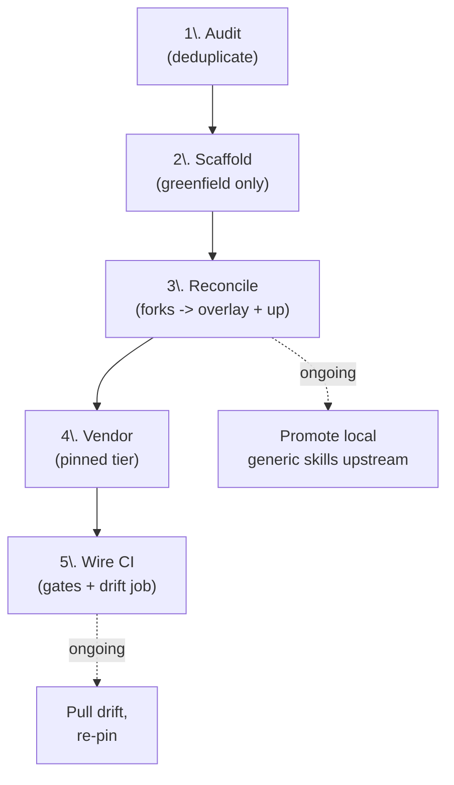

# Repository onboarding plan

How a .NET repository joins this commons - as a **consumer** of shared skill
cores, a **producer** of new ones, or both. This is the repo-level runbook; it
sits above [CONTRIBUTING.md](../CONTRIBUTING.md), which covers authoring a single
skill core, and [FORMAT.md](../FORMAT.md), which covers the file format. For the
sharing model see the [README](../README.md).

## 1. The roles a repository plays

| Role | Meaning | How |
| ---- | ------- | --- |
| **Consumer** | Vendors pinned, provenance-stamped copies of the cores it needs into `.agents/skills/`, each with a thin local overlay. | `gh skill install JeremyKuhne/agent-skills <skill> --pin vX.Y.Z` |
| **Producer** | Contributes a generic core *up* into this commons so every repo can vendor it. | PR to `skills/` here, then re-vendor back |
| **Tool-shipped (special case)** | A standalone tool whose skill's canonical home is the tool's own repo (single-sourced from the tool's docs), vendored into consumers from the tool repo rather than from this commons. | Vendor from the tool repo; pin to a tag/SHA |

Most repositories are **both** consumer and producer. The commons is
bidirectional: a generic improvement made anywhere flows back here (when
plausible - upstreaming is never automatic), while anything repo-specific stays
in that repo's overlay.

## 2. The onboarding pipeline

Five stages to bring a repo in, then two ongoing loops. Stages 1-5 are a
one-time sequence per repo; the promote and drift loops run forever.

## 3. Stage 1 - Pre-onboarding audit (deduplication discovery)

Before vendoring anything, inventory the repo's existing `.agents/skills/` (if
any) and classify **every** skill into exactly one bucket. This is the
deduplication and common-promotion engine - it decides what flows up, what comes
down, and what stays.

That package inventory is necessary but not sufficient for a selected new
skill. Before writing each project copy, run the `manage-skills`
[repository-integration gate](../skills/manage-skills/integrate.md). It searches
existing skills under every active project root, agent customization files,
documentation, and relevant implementation evidence for differently named
workflow overlap and repository-specific overlay material. It classifies that
evidence without treating a keyword match as duplication and keeps the portable
core unchanged.

| Bucket | Test | Action |
| ------ | ---- | ------ |
| **Identical** | Body matches a commons core already | Drop the local copy; vendor the pinned core + overlay |
| **Fork** | A local copy derived from a commons core but edited | **Reconcile** (Stage 3): diff, push the generic delta up, keep the repo delta in the overlay |
| **Local-generic** | Local-only, but the content is portable | **Promote** (section 8): genericize and contribute up, then vendor back |
| **Local-specific** | Local-only and genuinely repo-bound (paths, tool names, one-off conventions) | Keep local; never promote |
| **Missing** | A commons core the repo *should* carry but does not | Vendor it in Stage 4 |

Record the result as a per-repo row in a **deduplication ledger** - a fleet-level
tracker of what must flow up, come down, or be reconciled. The audit is the single
most valuable onboarding step: skipping it is how two repos end up with three
drifting copies of the same skill.

This fleet runbook persists skill-flow dispositions because it coordinates
several repositories. A normal project installation keeps its integration
report transient. If consolidation is declined or intentional overlap remains,
ask whether the user wants a catalog note, overlay boundary, issue, or ledger
entry; create no persistent overlap record by default.

Two axes decide the buckets, and they are independent:

- **Portability** - whether the installed core is self-contained (`portable`) or
  tied to one repository (`repo-specific`). A historical "semi-portable" skill
  must be split into a portable core plus an overlay before promotion.
- **Applicability** - whether the repo should carry the skill at all, by domain
  (`universal` / `dotnet-framework` / `cswin32` / `project-gated` / `repo-local`
  / ...). A skill can be highly portable yet narrowly applicable (a CsWin32-COM
  skill is generic across COM repos but must never land in a non-COM repo).

## 4. Stage 2 - Scaffold (greenfield repos only)

A repo with no `.agents/` (a greenfield repo) needs the consumer scaffolding stood
up before it can vendor. In this commons, use the repository-local
[create-skill-repo](../.agents/skills/create-skill-repo/SKILL.md) workflow in
consumer or hybrid mode and select the applicable validation and CI tiers. It
conducts the identity, location, client, starter-skill, upstream,
infrastructure, and publication decisions before writing. The exact filenames
below remain this fleet's convention rather than an Agent Skills requirement:

- `.agents/skills/` with a `README.md` catalog and a `FORMAT.md`.
- A frontmatter validator and an offline link checker (conventionally
  `tools/Validate-AgentFiles.ps1` and `tools/Test-AgentFileLinks.ps1`).
- A CI workflow that runs both on every push/PR (conventionally
  `.github/workflows/agent-files.yml`).
- An `AGENTS.md` (and its Copilot mirror) if the repo lacks one.

A merge repo (one that already has `.agents/skills/`) skips this stage and goes
straight to reconciliation.

## 5. Stage 3 - Reconcile forks (the deduplication merge)

For every **Fork** bucketed in Stage 1, run the three-way split:

1. **Diff** the fork against the matching commons core.
2. **Generic delta** (a clearer phrasing, a new universally-true check) -> it
   *should* go upstream, but **ask first** (a commons PR is a publish action and
   is never automatic). If accepted, re-vendor at the new pin. If not yet, keep
   it as a **tracked pending-upstream divergence** in the ledger - recorded, not
   hidden.
3. **Repo delta** (a path, a project name, a target-framework moniker, a
   cross-reference to that repo's other skills) -> move it to the repo's
   **overlay**, never the vendored core.

The merge rules a fork must satisfy to become "core + overlay" - they are the
same rules a producer follows in section 8, and the consumer's own link check
enforces them:

- **No outward links in the core** - not to sibling skills, instruction files,
  `docs/`, or the source tree. Each dangles in some other repo.
- **No repo-specific paths, project names, or TFM monikers in the core** - the
  core says "the perf project" and `-f <tfm>`; the overlay supplies the concrete
  values.
- **Vendoring is a merge, not a greenfield drop** - reconcile against the repo's
  existing catalog, `FORMAT.md`, instruction set, and integration findings rather
  than overwriting them.

The acid test: if the fork drops onto the pinned core with only a thin overlay
and the repo's link check passes, the core was genuinely generic. If the check
fails, the "core" still carried repo-specific content - fix the core, not the
consumer.

## 6. Stage 4 - Vendor the applicable tier

Vendor only the skills the repo's domain calls for (selective vendoring is the
*only* reliable control over where a skill fires - a skill not vendored cannot
fire). The generated [portfolio matrix](../skills/README.md#portfolio-contract)
is the source of truth for applicability, binding, risk, maturity, and
relationships.

- **Starting tier** - appropriate for most engineering repos: `manage-skills`,
  `agent-files-review`, `create-pr`, `address-pr-feedback`, `security-review`,
  `pre-pr-self-review`, and `code-comprehension`.
- **Released .NET domain** - available from the latest release and selected by
  the repository's work:
  `engineering-baseline`, `dotnet-polyfills`, `framework-jit-optimization`,
  `scratch-buffer-strategy`, `performance-testing`, `fuzz-testing`,
  `roslyn-analyzers`, `il-copy-inspection`, and, for CsWin32 repositories,
  `cswin32-interop` and `cswin32-com`. The COM skill declares the interop skill
  as a hard dependency.
- **Released GitHub domain** - `github-actions-cost-optimization` applies when a
  repository needs an evidence-based Actions cost audit.
- **Tool-shipped** - vendor from the tool's own repo, not here: a standalone
  tool's skill (for example `filtrace`), vendored from that tool's repo, for any
  repo that uses the tool.
- **Repo-local** - never vendored elsewhere (a repo's `publish-release`,
  `run-tests-on-wsl`, and similar).

Two vendoring wrinkles:

- **Project-gated prerequisite.** `fuzz-testing`, `performance-testing`, and
  `roslyn-analyzers` guide work in sibling projects but do not currently scaffold
  those projects. Vendor one when the project exists or after separately creating
  it to match the repository's layout. The engineering-baseline scaffold also
  leaves perf and fuzz projects as explicit optional follow-up work.
- **Layout detection.** The project-naming convention (`<root>`, `<root>.tests`,
  `<root>.perf`, `<root>.fuzz`) is not universal - some repos use a `src/<root>`
  layout and a `<root>_tests` underscore form instead. A vendored core must resolve
  against the host repo's *actual* layout, and the repo's overlay records the
  mapping where it deviates.

## 7. Stage 5 - Wire the consumer gates

A consumer's CI is what keeps a vendored core honest. Confirm the repo runs, on
every push and PR:

- The frontmatter validator over `.agents/skills/**`.
- The offline link checker - this is the gate that catches a core that still
  carries an outward link or a repo-specific path (a failed extraction).
- A report-only drift job (`gh skill update --all`, or a tree-SHA comparison
  script) that opens a PR when a vendored core diverges from its pinned upstream.

## 8. Producer workflow - promoting a local skill to the commons

For every **Local-generic** skill (Stage 1) and every accepted **generic delta**
(Stage 3), lift it into the commons:

1. **Genericize.** Strip repo-specific paths, project names, TFM monikers,
   cross-references, and source-example links. Replace concrete example links
   with generic instructions ("see the examples under your repo's
   `Framework/Polyfills/` tree"). Deep content the core truly needs travels as a
   bundled `references/` doc or a portable sibling.
2. **Classify.** Set all portfolio metadata fields: portability, applicability,
  binding, risk, maturity, requires, and related. Decide whether any local
  bindings need an `overlay.md` generated from the standard template.
3. **Author and tag.** Add the directory under `skills/`, follow
   [FORMAT.md](../FORMAT.md), pass the commons lint + offline link check
   ([CONTRIBUTING.md](../CONTRIBUTING.md)), and cut an immutable release tag.
4. **Vendor back.** Re-install the now-shared core into the origin repo at the new
   pin, moving anything repo-specific into that repo's overlay, and add the
   `shared-source` provenance row to its catalog.

A sibling file is tagged **portable** (travels with the shared core) or **overlay**
(repo-specific, stays behind) - the core/overlay boundary runs *through* a skill's
sibling set, not just between the core and its siblings.

## 9. Ongoing - common-change promotion and drift

Two loops run for the life of every consumer.

**Pull (drift).** `gh skill update` compares a vendored copy's provenance tree SHA
against upstream and surfaces drift as a normal diff. Review it like a dependency
bump; re-pin when satisfied.

**Push (improvement).** When you improve a vendored core locally, classify the
change before saving it:

- **Common** (benefits every consumer) -> it *should* go upstream, but **ask
  before opening a commons PR** (publish action, never automatic). Until
  upstreamed, keep it as a tracked pending-upstream divergence.
- **Local deviation** (a path, a one-off convention, a repo example) -> it belongs
  in the **overlay**, never in the vendored core.

**The golden rule** that keeps the bidirectional commons stable: *never let a
vendored core diverge silently.* An edit to a vendored core is a deliberate fork
that must end in one of three **recorded** states - promoted upstream and
re-pinned, moved to the overlay with the core restored, or kept as a tracked
pending-upstream divergence. The provenance SHA plus the drift check is what makes
that visible: unexplained drift with no upstream PR in flight is the alarm.

## 10. Governance gate

Required before any consumer is **external or public** (the moment a consumer is
outside your control). Most of this is already in place here (see the README's
governance section); confirm per onboarding wave:

- Commons visibility decided (public vs private) and a `LICENSE` present (MIT).
- Installs are **`--pin`ned** to a tag or SHA.
- **Immutable releases** so a pinned tag cannot be rewritten after the fact.
- Provenance frontmatter (source repo + ref + tree SHA) enforced across consumers
  so anyone can detect drift.

## 11. Onboarding checklist (any repo)

The one-screen restatement of the pipeline to run against any repository.

- [ ] **Audit** existing skills into the five buckets (section 3); record each in
      the fleet deduplication ledger.
- [ ] **Scaffold** if greenfield (section 4); otherwise reconcile in place.
- [ ] **Reconcile** every fork to core + overlay (section 5).
- [ ] **Promote** every local-generic skill upstream (section 8), then vendor back.
- [ ] **Vendor** the applicable tier, pinned, with overlays (section 6).
- [ ] **Wire** the validator, link checker, and drift job (section 7).
- [ ] **Govern** if the repo is external/public (section 10).
