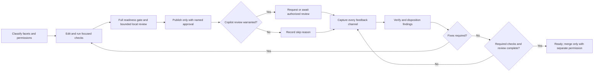

# Pull request review and iteration effectiveness plan

- Status: revised proposal; tooling and approval-policy changes are not implemented
- Assessment date: 2026-09-11 local time; GitHub evidence extends through
  2026-09-12 UTC
- Historical assessment baseline: `main` at `8abda52550b6e9b53f88f81da38b46905f5b3f74`
- Planning baseline: `main` at `27ab2e08a7e564181169135fffbc5f0c200d82c7`, synced
  on 2026-09-12
- Review mode: explicit Copilot requests; the maintainer reported automatic
  requests disabled on 2026-09-12
- Preceding work: [Sol and Luna skill evaluation](dual-model-evaluation-plan.md)
- Scope: local iteration, validation reliability, automated review, feedback
  handling, approval handoffs, and post-merge learning in this repository

## Milestones and current status

This workstream has not started. Its entry gate is **E4: paired pilot and
decision** in the [evaluation milestone tracker](dual-model-evaluation-plan.md#milestones-and-current-status).
The immediate action is E1.1 in that plan, not implementation of the whole PR
workflow. Full portfolio qualification and the optional hosted canary do not
block this workstream after E4.

The implementation agent owns local work and status updates; the maintainer
accepts exit evidence and authorizes policy/publication decisions. Use the same
states and completion rules as the evaluation tracker. Status last reviewed:
2026-09-12. No GitHub milestones or issues have been created.

| ID | Milestone | State | Depends on | Exit evidence and decision |
| --- | --- | --- | --- | --- |
| R0 | Evaluation handoff accepted | Blocked | Evaluation E1-E4 | Link the deterministic harness acceptance and pilot decision; preserve any failed quality gates and named follow-up work. |
| R1 | Remaining validation trust and host contract | Not started | R0 | Reuse E1 fixes; resolve remaining local/CI execution differences and record the PowerShell adopt/retain decision with test and setup-cost evidence. |
| R2 | Complete feedback and deliberate review requests | Not started | R0 | All-channel fixtures, body-only readiness block, explicit request/skip decisions, duplicate prevention, and no-write approval tests pass. |
| R3 | Unified validation and receipts | Not started | R1 | Local instructions and CI share command definitions; selection/fault tests pass, a supported full gate produces a current-content receipt, and durations/costs are recorded. |
| R4 | C# 14 audit and risk-specific proof | Not started | R0; align receipts with R3 | Every current C# guidance surface classified; older-language-only complexity removed, justified runtime requirements retained, and regression evidence recorded. |
| R5 | Optional bounded authorization | Not started | R2; separate policy approval | Named actions, expiry/scope stops, and optional merge gates tested without writes; the maintainer explicitly adopts or defers the policy. |
| R6 | Measured effectiveness decision | Not started | Relevant adopted controls and observation windows | Five-change checkpoint and ten-change comparison, mature post-merge windows, weekly cost decisions, and keep/adjust/rework outcome with unknowns explicit. |

Update state, assigned implementer, evidence links, blockers, and next action at
each work-session handoff. Link delivered commits/PRs rather than duplicating
their task lists. Weekly cost tracking starts in evaluation E1 and continues
here; do not wait for R6 to collect data. Record checkpoint dates when work
starts, with no speculative delivery dates or implied execution approval.

## Executive decision

Complete the dual-model harness and record the approved paired-pilot decision
in the [Sol and Luna evaluation plan](dual-model-evaluation-plan.md) before
starting this rollout. Full portfolio qualification continues in that workstream;
it need not finish before PR-process improvements begin. Narrow runner/CLI
repairs needed to trust the pilot are prerequisites, not a reason to start this
entire rollout early.

Then make existing checks trustworthy and remove avoidable repair work before
adding more process. Deliver in this order:

1. Fix false-green test reporting and ambient CLI dependency checks; establish
  explicit test tiers and consistent local/CI execution semantics.
2. Treat submitted review bodies as first-class feedback and verify each claim
  before fixing it or counting it as a defect.
3. Provide one validation entry point with minimal receipts, focused selection,
  and shared command definitions for local use and CI.
4. Simplify instructions and propose bounded task-level approval, with merge
  permission optional and separately named.
5. Use a small scorecard from the first implementation phase to determine
  whether these changes actually reduce iteration cost.

The historical high-feedback cases had successful deterministic checks, but that
does not establish that every reviewer complaint was correct. The local audit
also reproduced a test-runner false green and two environment-dependent failures
on the unchanged baseline. Feedback accounting, test infrastructure, and review
judgment need separate corrections.

This plan does not enable real model runs in CI, require every finding to be
fixed, impose a line-count limit, or authorize publication. The preceding
evaluation plan compares replay with a constrained live canary; live mode needs
a separate exception to current repository policy and a budget/security decision.
Preserve useful gates and make their prerequisites, guarantees, and costs explicit.

This document supplements the broader
[improvement strategy](improvement-strategy.md). The feedback work turns
that strategy's `address-pr-feedback` behavioral-evidence backlog into a
concrete workflow change and deterministic fixture. Measurement starts now;
dedicated metrics automation waits until the scorecard proves useful.

## Evidence and method

The planning baseline includes the new C# nullability-remediation skill and
expanded performance-testing scenarios. The
[evaluation plan](dual-model-evaluation-plan.md) now tracks 25 published skills
and 79 registered scenarios, including the nullability skill's missing model
coverage. The PR sample and local timings below remain historical observations
at `8abda52`; they were not rerun or relabeled as current-main evidence.

The baseline covers the 20 most recently merged pull requests available during
the assessment, from 2026-08-20 through 2026-09-12 UTC. Data came from the
GitHub pull request, review, review-comment, issue-comment, commit, check-run,
and review-thread APIs plus the current repository files.

For this assessment:

- A **review pass** is a Copilot review submission associated with a distinct
  head commit. Author reply submissions are excluded.
- An **inline finding** is a top-level pull request review comment. Replies are
  excluded.
- A **body finding** is an item counted by the reviewer's `Suppressed comments`
  section, whether presented as Markdown or an HTML summary. These are reported
  occurrences across passes, not independently verified or deduplicated defects.
- A **successful deterministic check** completed the named validation contract.
  A skipped or neutral check did not prove that contract. Report those states
  separately, and exclude the review bot's own completion check from test totals.

### Sample summary

| Measure | Observed result |
| --- | ---: |
| Merged pull requests | 20 |
| Median open-to-merge time | 0.85 hours |
| Pull requests with more than one review pass | 11 of 20 |
| Copilot review passes | 37 |
| Top-level inline findings | 27 |
| Body findings presented | 40 across 8 pull requests |
| Body findings labeled `Previously missed` | 11 |

The revision independently reproduced these totals through the GitHub APIs.
Five body findings used HTML summary headings; a Markdown-heading-only counter
missed them. The case-study sizes, check-run histories, and resolved-thread
counts below were also verified. The sample includes metadata and release PRs,
so it is not a like-for-like baseline for future behavioral changes.

Elapsed time is not a quality measure by itself. Maintainer availability affects
it, and a fast merge can move unfinished review work into a corrective pull
request. Body-finding totals can also count the same concern more than once when
it persists across review passes.

The API record cannot show whether a maintainer read a body finding and silently
deferred it. It can show that the current workflow and GitHub thread state do not
retain a per-finding disposition. This plan treats the absence of that record as
the control gap; it does not assume that every unrecorded finding was ignored or
valid.

### High-feedback case: PR #83

[#83, Clarify .NET file I/O guidance and add behavioral
evaluations](https://github.com/JeremyKuhne/agent-skills/pull/83) changed 19 files
and 3,393 lines. It took 8.2 hours, six commits, and six Copilot review passes.
Those passes presented seven top-level inline findings and nine body findings.

The reviewer raised concerns about:

- audit scenarios that allowed writes while claiming read-only mutation safety;
- Unix creation modes that could be masked by a restrictive `umask`;
- whether a short-read fixture exercised fragmentation on the relevant overload;
- runtime-dependent overload-counter assertions;
- use of a .NET 7 API under a declared .NET 6 host;
- stale and internally inconsistent validation counts; and
- a platform-specific file-sharing assertion stated as universal.

All six heads reported six successful and one skipped check. One successful
check was `copilot-pull-request-reviewer`, not deterministic validation; the
remaining five successful checks were deterministic jobs. Review completion
reported success even when its body requested changes.

The original assessment called the overload counters mutually exclusive. An
audit of the exact probe at `fa22a3a` found both counters equal to four for both
array and span calls on PowerShell 7.6.6 / .NET 10.0.12. This disproves that
universal claim, not a possible portability concern on another runtime. Require
a reproducer or runtime-source evidence before classifying it as a defect.

The timeline also shows incomplete feedback accounting:

| Pass | Head | Result |
| ---: | --- | --- |
| 1 | `a2ac6fa` | Three inline formatting/evidence findings. |
| 2 | `ed7cfe4` | One inline safety finding and three body-only test/permission findings. |
| 3 | `fa22a3a` | Two inline findings and three body findings, including one explicitly marked previously missed. |
| 4 | `91664b0` | One inline runtime finding and one body evidence finding. |
| 5 | `4043e17` | The body repeated the undispositioned evidence finding. |
| 6 | `9880eeb` | The body raised a new cross-platform locking concern. |

The seven inline threads are now resolved, but a body-only finding has no thread
to resolve. Whether the final concern was valid or not, the pull request has no
per-finding record of that decision.

### Escaped-work case: PRs #64 through #66

[#64, Add Windows ACL and cross-platform file creation
skills](https://github.com/JeremyKuhne/agent-skills/pull/64) was comparable in
size to #83 at 2,803 changed lines. It needed two review passes rather than six,
but its final pass still contained three body findings and a `Needs a closer
look` result. Its sole inline thread is resolved.

[#65, Correct Windows ACL and file creation
guidance](https://github.com/JeremyKuhne/agent-skills/pull/65) opened 1 hour and
47 minutes after #64 merged and explicitly describes itself as a correction in
response to review. Its first pass presented four inline findings and six body
findings. Its second pass said `Approval recommended` and `No unresolved review
comments were supplied`, while the same review body still presented five
suppressed findings. All four inline threads are resolved, and both heads had
four successful and one skipped check. These are all-check totals, not a count
of four independent deterministic test gates.

[#66, Correct Windows ACL documentation
formatting](https://github.com/JeremyKuhne/agent-skills/pull/66) opened 20 minutes
after #65 merged. This sequence shows why open-to-merge time and resolved thread
count can understate the actual stabilization cost. The timing alone does not
prove that #66, or every change in #65, was escaped work; only #65 explicitly
attributes its corrections to review.

### Size-matched comparison

[#78, Add .NET pipes skill and bounded echo
sample](https://github.com/JeremyKuhne/agent-skills/pull/78) changed 2,616 lines
across 36 files and needed two review passes. Together with #64, this argues
against treating raw line count as the explanation for six-pass churn. Semantic
breadth is a useful planning hypothesis, not a causal result from this small
sample: #83 changed guidance claims, production-style examples,
cross-platform tests, evaluation safety policy, scorer contracts, and mutable
evidence ledgers in one pull request.

### Local validation audit

The following are dated observations at the historical baseline SHA, on Windows with
PowerShell 7.6.6, .NET 10.0.12, and Pester 5.7.1. They are not current test totals
to maintain by hand as the repository changes.

| Check | Observed result | What it establishes |
| --- | --- | --- |
| Actual shard runner with a temporary `BeforeDiscovery` failure | Exit 0; zero tests and failures reported; child log contained one failed container | Confirmed false green, not just an inferred risk. |
| Mirror/link and skill-validator Pester files | 76 passed in 7.8 seconds | Focused validator coverage is useful and inexpensive on this host. |
| All 15 Pester files, four fresh-process workers | 371 passed, 2 failed, 11 skipped; 78.8 seconds | The unchanged baseline is not locally green in this environment. |
| Native Copilot resolution test alone | One executed test failed; 94 filtered out | Reproducible CLI capability mismatch, not a parallel-test interaction. |
| Slowest shard: user-voice | 57.6 seconds | A concrete latency target before adding scheduling infrastructure. |

The [shard runner](../tests/Invoke-PesterShards.ps1) checks `FailedCount` but not
Pester's overall result or failed containers. Its own repository contract checks
that the file exists, not that failure propagation works. The negative control
ran through the real entry point; its temporary fixture was removed afterward.

Both full-run failures involved Copilot CLI capability. The
[resolver test](../tests/evals/SkillEval.Tests.ps1) treats any application named
`copilot` as sufficient, while the implementation requires a native executable.
The [scaffold test](../tests/create-skill-repo/CreateSkillRepository.Tests.ps1)
conditionally performs real plugin installation whenever `Get-Command copilot`
succeeds. This host resolved VS Code and npm launchers, but no `copilot.exe` on
`PATH`; the smoke test could not find the installed artifact. A command name is
not proof of a compatible, noninteractive client.

The full Pester command was:

```pwsh
./tests/Invoke-PesterShards.ps1 -Path ./tests -MaxConcurrency 4 -PesterVersion 5.7.1
```

Shard logs were inspected for hidden container/block failures; none were found
in that full run. Tracked files were unchanged. This was not the full contributor
gate: Linux, minimum-host runs, the complete scaffold build matrix, and real
model evaluations were not run. A failed run's timing is diagnostic, not a
passing performance baseline.

## What already works

The response should build on the repository's current controls rather than
replace them:

- [CONTRIBUTING.md](../CONTRIBUTING.md) names the main local checks, although its
  Pester command differs from repository instructions and needs reconciliation.
- The [pull request template](../.github/PULL_REQUEST_TEMPLATE.md) already asks
  for positive triggers, near misses, expected output, gated actions,
  portability, tests, and metadata accuracy.
- Pull-request CI validates agent files, Markdown, links, skill contracts,
  plugin installation, a synthetic consumer, Pester tests, and scaffold
  canaries across Windows and Linux.
- [pre-pr-self-review](../skills/pre-pr-self-review/SKILL.md) already calls for a
  bounded local agentic review before publication and caps that local review at
  two passes.
- [address-pr-feedback](../skills/address-pr-feedback/SKILL.md) already requires
  verification and classification rather than blindly accepting a reviewer.
- Repository guidance keeps edits, commits, pushes, and pull-request writes as
  separate approval boundaries.

These are useful controls, not proof that failures are uncommon outside the
sample. Preserve the black-box negative tests, installed-artifact tests, and
consumer canaries while repairing the gaps below.

## Root causes

1. **Execution contracts differ.** CI runs Pester in-process with `Run.Throw`,
  while the local shard runner isolates files but misses discovery failures.
  [File-creation tests](../tests/dotnet-file-creation/FileCreation.Tests.ps1)
  reuse loaded C# types, so repeated runs in a persistent process can test stale
  code after an asset edit. Ambient client detection also changes test behavior.
2. **Feedback intake is incomplete.** The
  [fallback](../skills/address-pr-feedback/thread-workflow.md) selects
  unresolved threads, not all submitted review bodies. A pushed fix can start
  another review while already available feedback remains undispositioned.
3. **Proof and claims are conflated.** A passing scorer test is not evidence of
  useful model behavior; a reviewer assertion is not a demonstrated defect;
  running a broad gate again does not prove that a regression test discriminates.
4. **Instructions and evidence accumulate.** The
  [pre-PR checklist](../skills/pre-pr-self-review/SKILL.md) carries unconditional
  two-framework and Debug/Release instructions and says to add each newly found
  issue. Copied test totals and ever-growing checklists create maintenance work
  without necessarily adding protection.
5. **Handoffs are not measured.** Latest-message-only approval protects user
  control but requires repeated coordination during one feedback task. Session
  evidence shows repeated investigation/publication prompts; its share of
  elapsed time is unknown. Measure it rather than attributing all delay to CI.

## Testing strategy and technology

### Explicit test tiers

| Tier | Purpose and execution | What a pass does not prove |
| --- | --- | --- |
| Static contracts | Pinned Markdown/link tools, skill metadata, mirrors, catalogs, and manifest checks | Semantic correctness or agent behavior. |
| Hermetic script tests | Pester with synthetic inputs and explicit local prerequisites; no real client, credentials, or network needed | Integration with the actual installed CLI. |
| Compiled domain tests | Real C# assets and APIs, explicit runtime/OS, fresh processes | Untested filesystems, identities, privileges, or crash recovery. |
| Client/consumer integration | Pinned Copilot plugin smoke, synthetic consumer, scaffold build/test/pack canaries | Useful model output or every consuming repository. |
| Behavioral evaluations | Manual, opt-in model runs; routing/safety traces, human rubrics, and separately checked generated code | Broad efficacy from a small scenario set or regex matches alone. |

The [evaluation plan](dual-model-evaluation-plan.md) also compares deterministic
replay, Luna-first with capped Sol sampling, and paired live canaries within a
60-120-second hosted-job target. This is a proposal, initially dispatch-only;
live mode is prohibited until separately approved. A replay or small canary
never substitutes for full dual-model qualification or required platform tests.

Keep required integration jobs in CI. Give each tier an explicit invocation and
prerequisite check; do not silently skip a required integration and report full
success. A fast test run must not opportunistically launch a real client because
its name happens to exist on `PATH`. Test discovery, mocks, and process execution
must use the same semantics locally and in CI for overlapping checks.

### Keep, simplify, or replace

| Technology | Decision |
| --- | --- |
| PowerShell | Keep small entry points and platform orchestration. Use explicit arguments, structured JSON, known executables, and immediate exit checks. Do not rely on state from earlier terminal commands. |
| Pester | Keep black-box fixture tests. Add failure-path contracts for the runner and controlled absent/launcher/native CLI cases; move real CLI probes to the integration tier. |
| C# and Microsoft.Testing.Platform | Reuse the [existing MSTest stack](../tests/dotnet-pipes/DotNetPipes.Tests.csproj) for domain assets where compilation and API contracts matter. Avoid hiding supported-runtime assumptions in `Add-Type` inside a long-lived shell. |
| YAML and Markdown | Prefer established parsers or the existing canonical engine. Reduce duplicate regex readers and exact-whitespace workflow assertions; test parsed contracts, not incidental source formatting. |
| Evaluation harness | Preserve synthetic negative controls, isolated fixtures, observed invocation traces, and offline rescoring. Keep harness tests separate from claims about candidate model quality. |

PowerShell is not inherently the problem. Fragility concentrates in custom
parsing, implicit state, process boundaries, capability detection, and weak
failure tests. A typed, repository-internal implementation is worth considering
only when it removes substantial duplicated logic and can use established
libraries. Compare build/startup/deployment cost against the simpler script
repair first. Do not rewrite the entire stack or add a compiled dependency to
portable skill consumers as part of this plan.

Document the actual supported PowerShell and .NET hosts; a `#Requires` line is
not compatibility evidence. Either test a promised minimum or explicitly revise
that contract. Pin validation tools and declare prerequisites once, rather than
installing or discovering different dependencies during every edit cycle.

### C# 14 guidance baseline

Require C# 14 for all current C# guidance: shared skills, supporting prose,
recipes/assets, scaffold examples, and evaluation instructions and rubrics.
This is the agreed language baseline for implementation of this plan, not a
claim that the existing portfolio has already been audited. Do not add alternate
implementations or compatibility machinery solely to support an older C# version.

Use a tested .NET 10 SDK or later compiler and explicitly select
`LangVersion=14.0` in qualification builds, instead of floating `latest` or
`preview`. The current scaffold template uses `latest`; reconcile that setting
and its documentation during implementation. Record SDK/compiler and effective
language version separately from the target framework and execution runtime.
C# 14 does not imply a .NET 10 target or make newer runtime APIs available on an
older target. Preserve justified downlevel-framework APIs, attributes, and native
platform constraints; verify features with target-specific requirements.

Run a bounded portfolio audit, one owning skill or scaffold at a time:

- Inventory lower-language-version branches, duplicate examples, conditional
  syntax, helpers, and warnings that exist only for older C# compilers.
- Simplify those cases using the C# 14 baseline. Ordinary older syntax that is
  already clear needs no cosmetic rewrite or forced use of a newer feature.
- Classify retained complexity as runtime/TFM, public contract, platform,
  performance, historical explanation, or intentional diagnostic fixture, with
  evidence. Do not remove it merely because it mentions an older .NET version.
- Compile affected examples and representative consumers with C# 14 on their
  claimed targets; test behavior and preserve negative controls. A compiler
  upgrade alone does not prove runtime compatibility or performance parity.
- Align the format contract, repository guidance, templates, skill compatibility
  metadata, and evaluation expectations in scoped implementation changes. Keep
  historical measurements labeled; do not rewrite them as fresh C# 14 evidence.

Exit when every current C# guidance surface is classified and unexplained
lower-language-version accommodations are removed. Record audited/total surfaces,
removed compatibility branches/helpers, justified retentions, and validation
results. Judge simplification by fewer decisions and failure paths, not line
count alone. Ongoing reviews reject newly introduced lower-C# complexity rather
than silently expanding the support contract.

### PowerShell baseline decision

Evaluate whether a single supported PowerShell version would simplify repository
tooling. Validators currently declare 7.0, while the evaluation and shard entry
points declare 7.2. Use 7.6 as an initial candidate because the audited local host
already runs 7.6.6 on .NET 10; compare it with the oldest supported 7.x line that
meets the actual requirements. This is not a selected minimum or an assumption
that every runner or consumer already provides it.

Inventory concrete compatibility branches and API workarounds that each option
would remove. Distinguish the PowerShell language, cmdlet/native-process behavior,
hosted .NET runtime, and the compiler used by `Add-Type`. Verify those contracts;
do not assume a newer shell makes all C# 14 examples compile or replaces proper
process isolation, structured parsing, and failure handling.

Compare the same pinned Pester tests, executable helpers, and representative
validation/evaluation commands on Windows and Linux, including child processes
and the selected CI hosts. Record supported lifetime, availability, installation
or bootstrap cost, startup/runtime, failure behavior, and removed compatibility
code. Include fresh-runner setup in the existing canary time and cost targets.
If a higher minimum delivers no material simplification, retain the supported
lower option and record why.

The decision must name the exact supported line and tested patch, owner, update
cadence, migration impact, and evidence. If adopted, align prerequisite docs,
`#Requires`, CI provisioning, tests, and child-process executable selection;
unsupported hosts must fail clearly before work starts. A repository-tooling
minimum does not automatically raise the requirement of distributed skill
scripts or generated consumers: assess and approve that compatibility change
separately. This planning edit changes no active script requirement.

## Target workflow



### Change facets

Before validation, identify every facet touched by the change:

| Facet | Required proof |
| --- | --- |
| Portable skill or agent behavior | Trigger, near miss, expected result, forbidden action, package-wide contradiction scan. |
| Executable script or helper | Focused tests, error paths, supported host/runtime, and dependency behavior. |
| Regression test | Fail-before/pass-after evidence, or a negative control proving the intended failure signal. |
| Platform claim | Tested environments and explicit limits for OS, filesystem, identity, environment, and runtime variation. |
| Evaluation or scorer | Positive/negative polarity, tool allow/deny behavior, fixture isolation, and mutation checks; state what remains a manual rubric. |
| Validation evidence | Command, tested-content identity, environment, result, and receipt; no unsupported copied totals. |

A pull request should have one primary behavioral claim and the proof needed for
that claim. Split work when facets can land and be reviewed independently. Do
not split by line count alone; large fixtures or generated output can be
coherent, while a small change can alter several contracts.

Record the facets in a `Review evidence` section of the pull request body. Each
row links to a test, focused command result, validation receipt, or explicit
limitation. The author supplies it before review; the pre-PR workflow checks that
every changed facet has an entry. The reviewer still evaluates whether the
linked evidence proves the claim.

Only include touched facets. Run focused checks during editing and the full
relevant gate at readiness, not after every text change. Reuse evidence for
unchanged inputs and toolchains; invalidate it when its dependency closure,
selection rules, or environment changes. Do not infer validity from head SHA
alone or require new model runs merely to refresh deterministic evidence.

### Complete feedback snapshot

For every review pass, collect all four channels:

1. Submitted reviews, including every non-empty review body.
2. Inline review threads, including replies and resolution state.
3. Pull-request conversation comments.
4. Required checks and commit statuses, mapped to the reviewed head and actual
  tested checkout.

Use `GET /repos/{owner}/{repo}/pulls/{number}/reviews` for submitted reviews,
the GraphQL `reviewThreads` connection for threads and replies,
`GET /repos/{owner}/{repo}/issues/{number}/comments` for conversation comments,
and the required check/status APIs. Paginate every connection. Always retain the
complete non-empty body locally; heading parsing may improve presentation but
must not control inclusion. Mark each source inspected even when it yields no
finding. Retrieval proves capture, not that an agent read or understood it.

Track each source once by its API ID, then give body findings persistent local
subkeys under the review ID. Preserve edited-source revisions and link duplicate
occurrences to a logical finding rather than deleting their evidence. Record:

- reviewed head SHA and submission time; use `unknown` where a conversation
  comment does not identify a reviewed commit, rather than inventing one;
- path and line when available;
- channel: body, inline, or conversation;
- classification: valid, nit, out of scope, duplicate, or false positive;
- disposition and supporting evidence;
- fixing commit or follow-up issue when applicable; and
- whether it repeats an earlier finding on unchanged relevant code.

Capturing a finding does not make it correct. The existing verify-before-fix
rule remains. A false positive is complete when its evidence is recorded, not
when code is changed to satisfy it.

### Explicit Copilot review requests

Opening a PR or pushing a commit no longer schedules a Copilot review in this
repository. The acting agent must decide whether review is warranted after
each published candidate; absence of comments is not a completed review.

| Situation | Review decision |
| --- | --- |
| Initial substantive PR | Request one Copilot review when the PR is open, non-draft, and its local readiness gate and required deterministic CI checks pass. |
| Substantive changes since the last reviewed head | Request a fresh pass after the complete feedback batch is pushed and the re-review gate below passes. |
| Trivial-only changes | Skip the request and record the reason; retain deterministic checks and any required human review. |
| New evidence or a material concern not covered by a completed review | Record the specific reason for another pass; do not repeatedly request review of unchanged code merely to obtain approval wording. |
| Explicit user request or an applicable required-review rule | Treat review as required even if the change would otherwise qualify for a skip; obtain request authorization when absent. |

Substantive includes skill/agent behavior, triggers, permissions, safety rules,
technical guarantees, executable scripts, test logic, build logic, and workflow
behavior. Markdown-only changes can be substantive in this repository. Typos,
formatting, cosmetic rewording, and metadata with no behavioral effect are
normally trivial; classify by meaning, not file extension or line count.

Review requests are PR writes. Commit/push permission alone does not authorize
them; use explicit current approval or a named task grant only after that policy
is adopted. Without approval, report `review required; awaiting authorization`
and retain the obligation. Request a code review through the review mechanism,
never a comment asking Copilot's cloud coding agent to implement work.

Before requesting, refresh the PR head, pending requests, and submitted reviews.
Do not duplicate a pending or completed pass for the same reviewer/head; a
deliberate additional pass needs the specific new-evidence reason above. Record
the decision, reason, target head, request confirmation/time, and completion
review ID. A failed request or cancelled run is not a completed review.

Track a pending request through completion using supported notifications or a
recorded pending handoff, without busy-polling or silently abandoning it. On
completion, collect every feedback channel. If the head changed, retain the old
review as stale and evaluate the delta for a fresh request. A trivial-only delta
may reuse prior review coverage with its reviewed SHA and skip rationale recorded;
do not relabel it as a review of the current head or bypass required-review rules.

### Re-review gate

Before requesting re-review:

- every finding from the prior pass has a disposition;
- all valid in-scope findings are fixed on the current head;
- focused checks for those fixes pass;
- the full relevant deterministic gate passes; and
- the review packet and validation receipt identify the content being published.

Batch related fixes into a stable candidate instead of requesting review after
every intermediate push. A review started independently by a maintainer still
belongs in the inventory and must not be duplicated. Readiness requires all
policy-warranted reviews to be complete, even if GitHub branch protection does
not enforce them, plus disposition of every substantive finding.

Do not enforce a hard maximum number of remote reviews. The existing two-pass
cap applies to the local same-class reviewer, where diminishing returns are the
reason for the bound. Remote review stops when substantive findings are
complete, not when a counter reaches an arbitrary value.

### Bounded authorization proposal

This is a proposed policy change, not current permission. The existing
[repository approval rules](../AGENTS.md) remain in force until explicitly
changed in a separate implementation task.

Offer a task-scoped grant that names the repository, branch/PR, goal, permitted
actions, and stop conditions. Commit, push, PR edits, replies, resolutions, and
review requests must each be named; permission to edit alone grants none of
them. The grant may cover repeated authorized actions within that task without
asking again after every repair. It expires on completion, cancellation, or a
stop condition and must remain visible when a session resumes.

Merge is a separate, optional permission with a named merge method. Immediately
before merging, recheck the exact current head, required checks and reviews,
mergeability, complete feedback dispositions, and evidence for the current
tested content. Bind the merge to the expected head where the host supports it;
a changed head or base requiring new validation returns to the readiness gate.
Without merge permission, stop at ready-to-merge.

Stop for changed scope, conflicting user edits, contested material findings,
unresolved safety risks, or actions outside the grant. The grant never implies
force-push, history rewriting, branch deletion, privileged installation, or
paid model runs. A review request is not a request for the cloud coding agent
to implement work. Measure redundant handoffs separately from necessary new
decisions; reducing prompts must not reduce user control.

## Implementation plan

### Entry gate - dual-model evaluation

The [preceding evaluation plan](dual-model-evaluation-plan.md) replaces the
single-model baseline with GPT-5.6 Sol and GPT-5.6 Luna at shared `medium`
effort. It owns independent quality/safety gates, measured 6:1 token weighting,
success per cost unit, time-to-result and runner-cost accounting, and selection
of the cheapest qualified judging model. Use its reports and ongoing cost ledger
rather than copying model thresholds, rate tables, or mutable totals here.

This workstream starts after the paired harness's deterministic acceptance and
a recorded paired-pilot proceed/rework decision. A pilot decision is not full
portfolio qualification or proof that Luna is preferable; keep outstanding
quality/cost gates visible. Paid pilot and judging runs need separate approval.
This entry gate does not add model calls to CI or require a paid campaign for
each PR. Local evaluation models do not select the model behind GitHub-hosted
Copilot code review; explicit review-request rules above remain unchanged.

The constrained hosted-canary comparison is a separately approved follow-up,
not another prerequisite for starting this rollout. Record its mode and evidence
limits in receipts if adopted. Full model qualification remains manual outside
CI, and no recurring model spend is implied by adopting this PR workflow.

### Phase 0 - Make existing test results trustworthy

Reuse narrow runner and CLI repairs already completed for the evaluation pilot;
do not implement or measure the same fix twice under different plans.

Record the PowerShell-baseline comparison before consolidating host provisioning
and adding new compatibility workarounds. Do not delay a known correctness fix
while evaluating a broader host migration.

Repair the owning runner and tests before building an orchestrator. Use Pester's
overall result and container/block errors, validate result completeness, and
define zero-discovered, filtered-out, and platform-skipped outcomes separately.
Do not convert infrastructure errors into synthetic passed/failed test counts.

Separate hermetic tests from actual Copilot integration. Test command resolution
with controlled absent, launcher-only, and native-client fixtures. Put real
plugin smoke behind an explicit integration invocation with a pinned client;
fail a required integration clearly when its prerequisite is unavailable.
Align local and CI test execution with the corrected fresh-process contract.

**Exit criteria:** discovery/setup failure, assertion failure, missing/malformed
results, child startup failure, timeout, and unintended empty selection cannot
return success. Healthy and intentionally skipped cases remain distinguishable.
A clean supported checkout runs the hermetic tier without a real Copilot client,
credentials, network access, or tracked-file changes. Start the scorecard below
with these controls; do not delay a correctness repair to collect a baseline.

### Phase 1 - Complete feedback intake and explicit review requests

Update `address-pr-feedback` and its fallback for initial fetches and refreshes.
Use synthetic fixtures covering inline, body-only, and conversation findings;
replies, duplicates, pagination, edited bodies, resolved threads, and stale or
unknown review heads. Include Markdown and HTML headings plus an unstructured
non-empty body. No fixture should depend on a reviewer-specific heading.

**Exit criteria:** every source is retained once, duplicates remain traceable,
and stale evidence cannot appear as a current-head review. An undispositioned
body finding blocks readiness even with all threads resolved. Prepare replies
locally; remote writes still require the applicable explicit approval. A
false-positive disposition with evidence is complete without a code change.

Bind the explicit-request policy in repository guidance and local workflow
bindings for both initial PR creation and feedback handling. Do not hard-code
this repository's review setting into portable skill cores. Add synthetic
no-write cases for a substantive initial request, a trivial skip, a gated
follow-up request, missing approval, a pending same-head review, and a stale
completed review. Readiness must fail when a warranted review was never
requested or is still pending; the test must not rely on automatic review.

### Phase 2 - Share validation commands and produce minimal receipts

Create `tools/Invoke-PRValidation.ps1` as a thin orchestrator over existing
commands. It owns selection, process execution, and reporting, not duplicate
validation logic. Local instructions and overlapping CI steps must use the
same check definitions, tool versions, flags, and failure semantics. Preserve
CI job/platform isolation rather than serializing the matrix into one process.

#### Modes

- `-Changed`: fast checks from the merge-base-to-head changes plus staged,
  unstaged, deleted, renamed, and relevant untracked files. Include shared
  validator/configuration dependencies; unknown impact falls back conservatively
  and reports why. An empty intended selection is not a successful test run.
- `-Full`: the complete local readiness gate for the documented host, before
  initial review and after substantive feedback edits.
- `-ReceiptPath`: optional destination override for JSON and a short Markdown
  summary; default output is unique and outside the source tree.

Use explicit named check selection from the same definitions in CI. The local
full gate composes Markdown lint, offline links, agent files, both skill
validators, generated catalog validation, hermetic Pester tests, and applicable
compiled domain tests. Client integration and cross-platform scaffold matrices
remain separate required CI checks or explicitly selected local integrations.
Record what ran locally, what awaits CI, and what is inapplicable; never turn
an unavailable required prerequisite into a silent skip.

#### Receipt fields

- schema version, run ID, base SHA, PR head SHA, and actual tested checkout SHA;
- dirty state and a content fingerprint covering tested tracked and relevant
  untracked inputs; include CI's synthetic merge checkout when applicable;
- check selection and dependency/configuration identity;
- OS, architecture, host/runtime, and resolved tool versions;
- effective SDK/compiler and `LangVersion` for C# checks, plus the selected
  PowerShell host and child-process version where applicable;
- each command, arguments, exit result, phase durations, and log location;
- end-to-end wait to trustworthy evidence, queue delay, and campaign critical
  path, distinct from summed worker or runner time;
- CI workflow/run/attempt/job IDs, runner SKU/hardware, raw execution time,
  billable quantity, dated rate/source, and actual/estimated cost status;
- links to model/judge token costs, cache/artifact costs, and human intervention
  minutes when applicable, with retries and cancellations retained;
- discovered, executed, passed, failed, skipped, and not-run counts, with
  container/block and infrastructure failures separate; and
- checks not run with an explicit reason, including pending CI integrations.

Use `[System.IO.Path]::GetTempPath()` with
`agent-skills/pr-validation/<content-id>/<run-id>/`, not a shared head-only
directory that concurrent runs can overwrite. Reuse child structured results;
unknown counts are `null`, not invented from console text. In Pester,
`TotalCount` includes filtered-out tests and is not an executed count.

Stream child output under clear command headings, retain child exit codes, and
summarize failures on the console. Independent checks may finish after a failure;
dependent checks become blocked. The aggregate exits nonzero for a failed or
blocked required check. Do not run fix modes during validation. Fingerprints
are reproducible for identical inputs; timings, outcomes, and environment-sensitive
counts are observations, not values guaranteed by head SHA alone.

#### Exit criteria

- Local/CI parity is checked through shared structured definitions and behavior,
  not an exact textual match of workflow formatting.
- A stale catalog, broken link, invalid skill, and failed Pester shard produce
  distinct named failure records and a nonzero aggregate result.
- Fault fixtures cover dirty/untracked selection, shared dependencies, empty
  selection, missing tools, concurrent receipts, and changes during validation.
- A receipt cannot certify content changed after its inputs were captured.
- Measure wrapper overhead separately from child duration; preserve coverage
  while improving the scorecard's latency measures.

### Phase 3 - Improve proof and reduce coordination work

Extend the pre-PR workflow and reviewer packet with the change-facet table above.
Reuse existing domain and evaluation tests rather than recreating coverage
already added during PR #83 or the subsequent performance-validity update.
The new [nullability evaluation cases](../skills/csharp-nullability-remediation/evaluations.md)
also supply compiler-probe, consumer-contract, and blocked-probe requirements;
their prose-contract tests do not replace executable or model evidence. Add a
case only for a demonstrated gap:

1. Demonstrate short-read behavior and a non-fragmenting control without
  requiring a runtime-specific internal dispatch route.
2. Compile real assets on the promised minimum host/runtime or explicitly narrow
  the supported contract; do not certify it on a newer host alone.
3. Scope platform claims by filesystem, identity, environment, and runtime.
  Exercise restrictive `umask` and relevant overrides where promised.
4. Test permitted and forbidden evaluation actions separately. A final unchanged
  worktree cannot alone detect a write followed by restoration.

For a new regression test, prefer a fail-before/pass-after demonstration. When
that is impractical, require a negative control or branch-observation probe that
would fail if the test stopped exercising the intended behavior. Record the
command and observed failure once in `Review evidence` or its receipt; do not add
a source comment solely to preserve the observation. Reuse existing negative
controls when they demonstrate the changed contract.

Make domain-specific checklist items conditional. Put repository commands in
local bindings, and stop adding every review complaint to a universal checklist.
Choose a focused test, domain guidance, or no permanent addition based on the
verified failure. Remove obsolete instructions when replacing them.

Execute the C# 14 guidance audit above in these owning-surface batches. Remove
lower-language-version-only alternatives, validate claimed runtime/TFM contracts,
and update the shared guidance contract and evaluation rubrics together. Track
the PowerShell decision and any separately approved consumer migration rather
than mixing them into unrelated skill fixes.

Implement bounded authorization only after separate policy approval. Test
absent, partial, expired, cancelled, resumed, and scope-changed grants; include
optional merge permission and a changed-head stop using synthetic no-write
fixtures. Keep the existing local two-pass reviewer cap. Escalate repeated
disagreement without new evidence rather than generating endless repair rounds.

#### Exit criteria

- New regression tests have demonstrated failure signals; executable and
  platform claims have scoped evidence or an explicit limitation.
- Current C# guidance is audited against C# 14, with no unexplained complexity
  for older C# versions and target/runtime compatibility independently checked.
- The PowerShell baseline has an evidence-backed adopt/retain decision; any
  adopted minimum is consistent across its documented local/CI scope.
- Evaluations distinguish scorer, routing, safety, manual rubric, and executable
  output results; an unchecked manual gate is not a pass.
- The task can complete repeated named actions without redundant approval, but
  no ungranted action, including merge, is allowed by implication.
- The scorecard shows whether reduced instructions and handoffs save work.

## Measuring success

### Owner, records, and cadence

The repository maintainer owns the scorecard and confirms attribution of repair
work. The acting agent records observations at each readiness run and feedback
round, then drafts one closeout row per logical change. This is part of the
workflow from Phase 0, not a prerequisite for a separate metrics service.

Link the paired-model report and cohort ID when behavioral evaluation evidence
applies. Use the preceding plan's timing definitions, rate-versioned cost ledger,
and cost/speed decision rule. This scorecard adds PR iteration and merged-change
attribution, not a second accounting system. Record model/effort, host, cache,
trigger, and workload changes when comparing cohorts; a cheaper model or fewer
reviews alone does not prove more effective PR handling.

Initially use a small local CSV or Markdown table plus command results and
feedback IDs. Once available, receipts and inventories supply those fields
without copying counts into prose. Each row records:

- logical-change/PR links, facets, rollout cohort, and relevant content/run IDs;
- validation mode, host/toolset, command duration, result, and failure category;
- review mode, request/skip decision and reason, eligible head, request and
  completion times, source/finding IDs, dispositions, and receipt references;
- avoidable repair rounds and redundant authorization handoffs, with reasons;
- workflow-recording time, post-merge corrections, and observation completeness.

After each evaluation campaign, record its summary. Review costs weekly across
all deterministic, integration, scaffold, and evaluation work, using the prior
week and rolling four weeks. Include PR updates, post-merge/tag/scheduled jobs,
reruns, cancellations, and storage. Reconcile actual billing when available and
label estimates; do not add normalized token units, dollars, and human minutes
into one unsupported total. Apply verified rounding per job, not to the total
critical-path time, and avoid counting shared receipts/jobs twice.

The maintainer selects a bounded savings experiment or records why none is
warranted. Reuse the evaluation plan's baseline, matched-comparison, payback,
decision, and realized-savings process. Prefer removing redundant work before
buying faster hosts. Lowest evidenced cost is the default at the same gates;
prefer faster at measured, approved roughly equivalent cost, and record explicit
approval for a higher premium. Latency targets do not independently authorize
extra spend, reduced review coverage, or relaxed validation.

Retain the small aggregate ledger and receipts outside the tracked source tree
until comparison is complete. Temporary storage may be lost: use a maintainer-
chosen local evidence directory or approved CI artifacts when retention matters.
Do not copy raw review bodies, prompts, transcripts, credentials, or personal
session content into the repository. GitHub remains the source for review text.

Take these checkpoints:

1. **Start:** retain the historical assessment and local audit above. Begin
   recording five consecutive qualifying logical changes for duration, repair,
   and handoff baselines that history cannot reliably reconstruct. Record when
   each control changes; never postpone a correctness fix for a cleaner sample.
2. **Midpoint:** inspect the first five completed changes under the revised
   workflow. Correct missing data or new friction without waiting for a release.
3. **Decision:** compare the first ten qualifying changes under the revised
  workflow, including the midpoint's five, with the prospective baseline.
  Use weekly trend reports if ten have not yet completed; show the smaller
  denominator rather than delaying all feedback.
4. **Follow-through:** evaluate post-merge outcomes after seven days per change.
   Keep incomplete windows marked pending and refresh the decision report when
   they mature. Rebaseline after the first complete comparison.

Historical PR totals cannot supply missing author-time or disposition data.
Mark unavailable observations unknown. A sequential, small-sample comparison is
operational evidence, not proof that one intervention caused the improvement.

### Definitions and denominators

- A **qualifying logical change** modifies skill/agent behavior, executable
  code, tests, evaluation/scoring, or workflow behavior. Exclude pure releases,
  metadata, and formatting from that cohort but report them separately. Group
  intentional follow-ups and corrective PRs on the same behavior under one ID;
  splitting PRs must not improve the score by itself.
- A **readiness round** starts when the author first runs the required readiness
  gate for a candidate and ends when that candidate is published or deliberately
  withdrawn. Intentional failing negative controls during development are not
  failed readiness attempts. Retain unsuccessful attempts, not only the final
  green run.
- An **avoidable repair round** repeats readiness work because of test/harness
  failure, local/CI command drift, previously available but missed feedback,
  stale evidence, or a defect introduced while addressing feedback. Count a
  round once, retaining all applicable causes and linked evidence. A genuinely
  new verified finding is separate; do not relabel an uninvestigated repeat as
  new. The maintainer confirms disputed attribution. The cohort's repair rate
  is total avoidable repair rounds divided by qualifying logical changes.
- A **clean iteration** is a completed readiness round with no avoidable repair
  through the subsequent review disposition. Its rate is clean rounds divided
  by all assessable completed rounds; report pending/unknown rounds separately.
- A **review-eligible candidate** is a stable PR head meeting the initial or
  follow-up review criteria above. Track validation/approval-blocked and
  superseded candidates separately, linking replacements; neither is completed
  review coverage or a trivial skip.
- A **redundant handoff** asks again for an action already covered by an active
  task grant. Initial approval, changed scope, contested findings, and ungranted
  merge are necessary decisions, not overhead to eliminate. Compare opted-in
  task grants separately from per-message approval.

For time measurements, separate local command time, CI queue/execution time,
request-approval wait, request-to-review completion, and author response time;
do not infer active work from time between comments. Compare the same check tier,
host/toolset, cache state, facet class, and review mode. The historical automatic-
request sample and the explicit-request cohort are different regimes: fewer
passes alone is not an improvement if review coverage fell. Report sample size
and median; report p90 using nearest-rank only with at least ten comparable
observations, otherwise show the range.

Measure local wait through trustworthy result availability, not just a fast
child command. Separately sum machine execution and billable usage across every
job/attempt; parallel jobs save wait but still each cost money or quota. Report
cost per ready candidate and per logical merged change, alongside campaign
cost per successful outcome and total spend. Retain failed and superseded work
even when the next iteration passes. Unknown costs are not zero; reduced volume
or dropped obligations do not establish efficiency.

### Initial scorecard

These are working targets, not promises or permanent service-level objectives.
Reliability and authorization conditions are hard gates; speed and repair-rate
targets are evaluated at the ten-change checkpoint.

| Measure | Baseline/source | Initial target and decision |
| --- | --- | --- |
| False-green validation | One reproduced discovery-failure case; runner fault fixtures and real-run failures | Zero accepted false greens; all required fault cases fail correctly. Any observed recurrence blocks a readiness claim. |
| Hermetic prerequisite reliability | Two ambient CLI failures in one 384-discovered-test run | No CLI-, credential-, or network-dependent outcome in the hermetic tier; missing integration prerequisites are explicit failures, not hidden skips. |
| Clean iteration rate | Prospective round ledger; historical rate unknown | At least 80% of assessable rounds and no decline from baseline; show numerator/denominator and every unknown. |
| Avoidable repair rounds | Prospective counts per logical change and attributed cause | At least 30% fewer rounds per change than baseline. If baseline is zero, maintain zero; investigate causes rather than inventing a relative improvement. |
| Appropriate review requests | Per-candidate eligibility, request confirmation, completed review, and skip reason | All eligible candidates reaching merge have completed warranted review; zero forgotten or accidental duplicate requests. Report requested/eligible and completed/requested counts, with blocked, superseded, and trivial skips separate. |
| Feedback completeness | Inventory at every publication/re-review and merge checkpoint | All prior findings dispositioned; zero merges with an undispositioned body finding and zero repeated findings caused by missed intake. |
| Failure-signal evidence | New/changed regression tests and their negative controls | Every applicable regression has evidence, reported as covered/total; no source comment or duplicated ledger required. |
| Language and host simplification | C# 14 audit ledger and matched PowerShell-host comparison | All current C# guidance surfaces classified; no unexplained older-language accommodation. Record removed workarounds, justified retentions, and the shell adopt/retain decision with setup/runtime cost. |
| Local feedback latency | Receipt p50/p90 by tier; audit: 7.8-second focused checks, 78.8-second failing full run | At least 20% lower median for matched iteration workloads, with no more than 10% full-gate slowdown on a frozen, passing comparison workload. Record wrapper overhead separately. |
| CI and lifecycle cost | All-job machine/billed time, versioned actual/estimated rates, token/judge cost, human and repair overhead | Weekly total and unit-cost trends with complete attribution. Adopt evidenced lower-cost equivalents; any extra cost for speed has an explicit decision or fits an approved equivalence rule. |
| Constrained CI feasibility | Replay/live mode and host comparisons in the evaluation plan | Aim for a useful 60-120-second whole job; record queue wait, cost, deadline misses, and limited coverage. No live or recurring run without separate approvals. |
| Redundant approval handoffs | Per-round action/grant log | Zero re-approvals for already granted actions in opted-in tasks; retain all necessary new decisions. No unauthorized action is acceptable. |
| Process-recording overhead | Approximate active minutes per change, not wall-clock wait | At most five minutes per logical change once receipts are available. Simplify fields or automate existing records if exceeded. |
| Escaped work | Manually attributed corrective PRs within 48 hours and seven days | Zero corrections attributable to known pre-merge findings within 48 hours; no increase in seven-day verified regressions per change versus the prospective baseline. |

Raw review passes and findings remain diagnostic: report median/p90 passes per
logical change, valid/duplicate/false-positive/out-of-scope dispositions, repeated
findings, and genuinely new findings on unchanged code. Do not set a target for
fewer valid findings or faster merges. Missing data is not zero, a dropped check
is not a speedup, and a skipped test is not a pass.

### Acceptance and adjustment

Call the rollout successful only when the hard gates hold and the ten-change
comparison meets the clean-iteration, repair, latency, handoff, and overhead
targets without increased escaped work or unexplained cost increases. Weekly
reports must show the source and decision for savings or speed premiums, not
just shorter durations. If a baseline or post-merge window is
missing, report the affected outcome as not yet evaluated, not successful.
Keep confirmed correctness fixes even when an efficiency target is missed.

At each checkpoint identify the largest remaining source of repair or delay and
choose one adjustment. If a process step adds cost without better completeness
or defect detection, remove or simplify it. Do not change thresholds after seeing
the result without recording the failed target and the reason for rebaselining.

Only after two useful scorecard reports, consider a read-only report mode over
existing receipts, inventories, and GitHub timestamps. It must consume recorded
dispositions, not infer them from resolved threads or reviewer labels. No new
service, dashboard, database, or scheduled job is required to measure success.

## Delivery order

The R0-R6 tracker above is the source of execution status. After R0, remaining
validation work, feedback intake, and the C# 14 audit can advance independently
where their checks allow; R3 depends on the trustworthy execution contract.
R5 is a separate optional governance decision, not implicit permission for the
other milestones. R6 evaluates adopted controls rather than waiting for every
optional experiment to finish.

Weekly cost assessment spans these deliveries from the start; its evidence and
reduction backlog live in the preceding plan's shared ledger. A dispatch-only
CI canary comparison is a separately gated follow-up, not a requirement to
complete this PR rollout or a new automatic paid job.

Measurement begins with implementation; only reporting automation comes later.
Feedback intake and disposition belong together. Wire the validation entry point
into CI in the same delivery as local adoption so there is no new parallel recipe
to maintain. Preserve safety repairs even if later workflow experiments change.

Start with the existing owners and at most two new thin entry points: feedback
inventory and validation orchestration. Reuse child reports for the scorecard.
A typed core or additional component requires a separate, evidence-backed
decision showing which duplicated behavior it removes and how it is distributed.

## Alternatives rejected

### Add more broad CI

Every sampled head in PRs #83 and #65 had successful deterministic checks. More
repetitions cannot replace trustworthy failure reporting, targeted proof, or
verification of the reviewer's claim. Add a gate only for a named failure mode;
measure its cost and remove redundant coverage where justified.

### Require smaller pull requests by line count

PRs #64 and #78 were close to #83 in size and needed only two reviewer passes.
Semantic facets and coupling are better split criteria than changed lines.

### Request reviews until the bot approves

PR #65 received `Approval recommended` while its review body still listed five
findings. Approval labels are not a substitute for finding disposition, and
repeated same-class reviews have diminishing returns.

### Treat every automated finding as mandatory

Automated reviewers produce false positives and nits. Mandatory fixes can make
the code worse. Completeness means verify and disposition every finding; it does
not mean accept every suggestion.

### Persist raw review transcripts

The source pull request remains the record. Store aggregate metrics, stable IDs,
classifications, and links. Do not duplicate raw reviewer text or model traces
in the repository by default.

## Risks and controls

| Risk | Control |
| --- | --- |
| Workflow becomes slower before a PR opens | Measure matched latency and recording overhead; reserve `-Full` for readiness and remove redundant steps. |
| Feedback parser overfits one reviewer format | Ingest complete review bodies; treat heading parsing as optional presentation. |
| Automatic requests are disabled and needed review is forgotten | Explicit eligibility decision, request confirmation, pending-review tracking, and review-coverage scorecard. |
| False positives create repair work | Require a reproducer or scoped evidence before fixing; preserve evidence-backed disagreements. |
| Unified script hides failures or stale inputs | Test discovery/process failures, validate content identity, and retain command results. |
| Metrics reward gaming | Keep unsuccessful attempts, unknowns, and skipped checks visible; group related PRs and track escaped work. |
| Broader permission outlives user intent | Named task/actions, visible expiry and stops, optional separate merge, and current-head verification. |
| A language migration adds deployment burden | Start with local repairs; require evidence before extracting a typed core. |
| Model evaluation increases cost or leaks prompts | Current policy bans live CI; a narrow canary needs separate policy/security approval, trusted inputs, and enforceable dispatch/weekly budgets. Full evaluations remain manual. |
| Speed or lower activity hides increased cost | Report all-job billed usage, actual and normalized costs, human/repair time, and matched unit-cost trends; record premiums and realized savings weekly. |

## Completion definition

For each candidate, the maintainer must be able to answer:

1. What behavioral facets changed and what proof covers each one?
2. Did the relevant local and CI checks use the same execution contract, and
  what content and environment did each actually test?
3. Was a warranted Copilot review explicitly requested and completed, or a
  justified skip recorded, and was every feedback channel read?
4. Does every finding have a verified disposition tied to its source and known
  reviewed head, without treating an uncertain claim as a proven defect?
5. Did the next review reveal a genuinely new issue, or repeat work that was
   already available?
6. Did the change remain stable after merge without an avoidable corrective
   pull request?
7. Did fewer repair rounds, faster useful feedback, and fewer redundant handoffs
  justify the process cost, without bypassing a required check or permission?
8. What did the complete change lifecycle cost, how did its unit cost change,
   and what measured saving or explicit speed-premium decision follows?

Receipts and inventories make individual rounds explainable. The scorecard and
explicit comparison targets determine whether the revised workflow is better.
